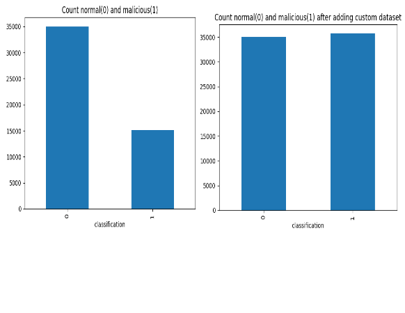
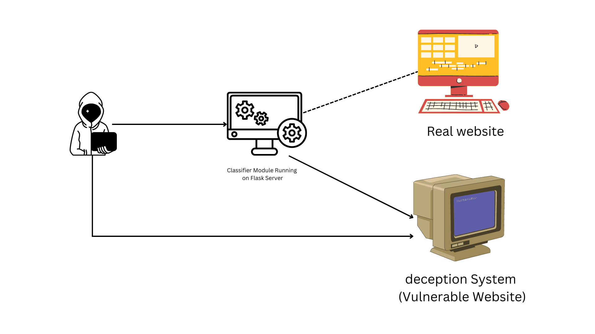

# IT352_Final_Submission

## How to Run code
to run the app, clone the repository. Then install [Docker desktop](https://docs.docker.com/desktop/install/windows-install/).<br>

Download the files from google drive [link](https://drive.google.com/drive/folders/1-W6iGwJ8J07cd4WfGjRxf3nfbcmJ_iQH?usp=sharing) or take them from results.<br>
Put them in router --> files(folder) There areb three files (model.h5,tokenizer.pkl,pad_sequence.pkl).

To run the application run the command given below in cmd with folder where docker-compose.yml is.

```
docker compose up
```

-----
## Cookie Analyzer

* XSS Payload <br>
  to detect XSS payload 
  ```
  def detect_xss(self,cookies):
        for payload in cookies:
   
            if re.search(r'<script.*?>.*?</script>', payload, re.IGNORECASE | re.DOTALL):
                return True
            if re.search(r'on\w+?\s*?=.*?(\'|")(.*?)\\1', payload, re.IGNORECASE | re.DOTALL):
                return True
            if re.search(r'<.*?src\s*=\s*(\'|")(.*?)\\1', payload, re.IGNORECASE | re.DOTALL):
                return True
            if re.search(r'<.*?href\s*=\s*(\'|")(.*?)\\1', payload, re.IGNORECASE | re.DOTALL):
                return True
            if re.search(r'<.*?(style|script|iframe|embed|object|applet|meta|base|form|input|textarea|button|select|option|fieldset|legend|label|a|img|video|audio|source|track|canvas|svg|math|table|caption|th|tr|td|thead|tbody|tfoot|colgroup|col|pre|code|samp|kbd|var|dfn|cite|abbr|acronym|q|sub|sup|tt|i|b|big|small|em|strong|u|s|strike|center|hr|ruby|rt|rp|bdi|bdo|wbr)\b.*?>', payload, re.IGNORECASE | re.DOTALL):
                return True
           
        return False
  ```
 

  > total 6586 request was sent on testing flask server to test with cookie containing malicious XSS payload .
  > payoload was taken from [github repo](https://github.com/payloadbox/xss-payload-list/blob/master/Intruder/xss-payload-list.txt) .

* SQL payloads <br>
  to detect SQL injection payloads
   ```
   def sql_injection(self,cookies):

        patterns = [
            r"(?:')|(?:--)|(/\\\*)|(\\\*/)|(\b(select|union|insert|update|delete|drop|alter)\b)",
            r"((?:%3D)|(?:%27)|(?:%23)|(#x3D)|(?:%3B))",
            r"((?:(?:&#\d+;)?&\w+;)+)",
            r"\b(select|update|insert|delete|drop|alter)\b.+?\b(select|update|insert|delete|drop|alter)\b",
            r"((\d|\b)sleep\b(\d|\b))",
            r"((\b(and|or)\b.+?\d+\s*=\s*\d+))",
            r"((\b(and|or)\b.+?\b(true|false)\b))",
            r"((\bunion\b.+?\b(select|update|insert|delete|drop|alter)\b))",
            r"((\b(select|update|insert|delete|drop|alter)\b.+?\b(from|into)\b.+?\bhttp))"
        ]
   
        for pattern in patterns:
            for cookie in cookies:
                if re.search(pattern, str(cookie), re.IGNORECASE):
                    return True
        return False
    ```
   > total 1432 request was sent on testing flask server to test with cookie containing malicious sql injection payload .
   >Payload was taken from [github repo](https://github.com/swisskyrepo/PayloadsAllTheThings/tree/master/SQL%20Injection/Intruder) .


* CMD injection payloads <br>
  to detect CMD injection 
  ```
   def detect_cmd_injection(self,cookies):
        cmd_pattern =r"^(?:(?!(?i)(?<!\\)\\b(rm|mv|cp|mkdir|touch|chmod|chown|chgrp|ps|kill|shutdown|reboot|poweroff|halt|init|service|systemctl|lsb_release|uname|id|whoami|pwd|cd|echo|printf|date|cal|cat|more|less|head|tail|grep|find|awk|sed|cut|sort|uniq|wc|du|df|free|top|vmstat|sar|netstat|nc|telnet|ssh|scp|sftp|ftp|curl|wget|lynx|links|ping|traceroute|nslookup|dig)\\b).)$|(^[|<>&'\"$()].)|(.?[|<>&'\"$()].)|(.?\\b(include|require(_once)?)(\s\(.?\))?.)|(.?(?i)\\b(eval|assert|system|shell_exec|exec|passthru|popen|proc_open)\\s\(\s*(?i)(base64_decode|gzinflate|str_rot13|strtr|base_convert|convert_uudecode|urldecode|rawurldecode|hex2bin|bin2hex|gzuncompress)\s*\(\s*(.)\s\)\s*\).*)$"
        for cookie in cookies:
            if re.search(cmd_pattern, str(cookie), re.IGNORECASE):
                return True
       
        return False
  ```
    

    >total 520 request was sent on testing flask server to test with cookie containing malicious command line injection payload .
    >Command line injection was taken from [github repo](https://github.com/payloadbox/command-injection-payload-list) .

* Final Result<br>
    total 52361 request was sent (malicious payload=8508, normal=43853).<br>
    ## classification report <br>
    <br>
    ## confusion matrix <br>
     <br>

---


## Deep Classifier

* Dataset <br>
 > The ECML/PKDD dataset is publicly available dataset. 
 >made up of http request where total 15110 request are malicious and 35006.<br>
 > we added some malicious request from our side by making a custom dataset.<br>
 >To create custom dataset we used OWASP ZAP proxy. Using ZAP fuzzing we sent the malicious request to a flask server we save those request data.<br>
 > After adding the custom dataset.
 <br>

we have devided this dataset in three parts 60% for training, 20% for validation, and 20% for testing.
<br>
 ### **results are given in following images.* 

- Features selected<br>
 In paper for choosing selecting the features from http rquest reasons are given

1. *Request Type* - This field is deliberately modified by attackers to request some resource by tampering HTTP verbs. For example, the OPTIONS Request
Type would let an attacker analyze the response headers to find out all supported HTTP request methods.

2. *Accept Header* - Attackers often manipulate this field to check for security mis-configurations on directory files. It is used in context with URL and Request Type headers.

3. *Encoding* - This field is helpful in finding out Attacker’s impersonation of an authorized user’s HTTP request because the website already knows about all information about user preferences.
 
4. *Language* - Like encoding this field is also related to user’s preferences and any change or abnormality can be noticed if analyzed properly.

5. *User Agent* - This feature is pretty helpful as WAVS related details can be obtained, if not forged. Moreover, website security mechanism uses this to find any difference in preferences.

6. *Cookie (Data)*- Cookies contain user session information and authentication levels and user preferences. Attackers modify/forge/inject cookies in order to hijack sessions and perform other attacks. (for cookie analyzer)

7. *Content Length* - This field helps in finding out attackers who send multiple POST HTTP requests to web forms (using WAVS or otherwise) having differing lengths. It is also used in detecting HTTP Request smuggling attack.

8. *URL* - This parameter is vital when linked with user’s profile and authorization levels. It helps in detecting directory brute-forcing, DoS and DDoS attacks. When looked upon in conjunction with other features, it becomes very useful in detecting attack traffic.
<br>

 - A NLP model was created using this architecture.<br>
  
 

 - #### results <br>
 Confusion Matrix<br>
 <br>
 Epochs Vs Accuracy <br>
 <br>
 Epochs Vs Loss <br>
 <br>
 Classification Report<br>
 <br>
 ROC Curve<br>
 <br>
-----

## Decetion System

>A web deception system is a type of cybersecurity technology that is used to detect and prevent malicious activities on a website or web application. The system works by deploying deceptive techniques such as honeypots, honeytokens, and other traps that are designed to lure attackers into revealing their methods and tactics.
A honeypot is a fake target that appears to be a legitimate resource, but is actually designed to attract and track attackers. A honeytoken is a piece of fake data, such as a username or password, that is planted on a site and monitored for unauthorized access attempts. These deception techniques are intended to divert attackers away from legitimate resources, provide early warning of attacks, and gather intelligence about the attackers' methods.
Web deception systems can also be used to automate responses to detected attacks, such as blocking IP addresses or triggering alerts to security personnel. By employing web deception systems, organizations can gain a greater understanding of the tactics used by attackers and enhance their overall security posture.


- The proposed web deception framework caters for a large number of web application attacks  in real time by engaging the attacker in an efficient way through deceptive lures running in separate dockers which are controlled and managed by the docker controller. The proposed framework is suitable for deployment in any scenario as it is also coupled with a hybrid web attack detection framework where traffic detected as benign is ted to the website whereas malicious HTTP traffic is diverted towards the deception system.The hybrid web attack detection framework comprises of two modules, a convolutional neural twork based deep learning classifier and a Cookie Analysis Engine (CAE). This hybrid detection framework when coupled with the proposed deception system enables the later to manage user sessions, enhances agility, effectiveness and robustness.

*what is deception system?*<br>
*Deception in cybersecurity refers to the practice of creating misleading information or hiding critical information to mislead attackers and prevent them from gaining unauthorized access to a system or network. The goal of deception is to make an attacker waste their time and resources on fake or meaningless targets, while the actual assets remain protected.*<br>
In our we have created web deception system which is consisted of major three parts:<br>
1. Classifier Module
2. User profiler
3. A mirror website with vulnerability
4. Main website with proper sanitization and standard security measures. <br>

- Overview of our system <br>
 <br>
 All incoming request will be passed through single entrypoint which is Flask server here. flask server is working a proxy server which routes the incoming request to main website or vulnerable website based on the combined decision of User_profiler + classifier_module.<br>
 Real website is made with all security measures and prpoer sanitization of inputs. Whereas vulnerable website is created vulnerable to attract the attacker with database containing some dummy values.
 if a attacker sends a malicious request then he will be engaged into vulnerable website instead of real website.

 ### *why choose to docker over VM?*
 >There are several advantages of using Docker over traditional virtualization with VMs:
>1. Efficiency : Docker containers are lightweight and use fewer resources than VMs, which means you can run more containers on the same server. This also means it takes less time to start and stop a container than a VM.
>2. Isolation: Docker containers use OS-level virtualization, which provides lightweight isolation between processes running in different containers while still sharing the host OS kernel. In contrast, VMs require a separate operating system for each VM, which can be resource-intensive.
>3. Portability: Docker containers can easily be moved from one environment to another, such as from a developer's laptop to a test environment to production, without requiring changes to the application or its dependencies. This makes it easier to manage deployments across different environments.
>4. Ease of use: Docker makes it easy to package an application and its dependencies into a single container that can be shared and reused by other developers, making it easier to maintain consistency across development, testing, and production environments.
>5. Faster deployment: With Docker, you can deploy applications faster since you don't need to install and configure an entire operating system or virtual hardware. Instead, you can just launch a container and start running your application.
<br>
> Overall, Docker provides an efficient, isolated, portable, and easy-to-use solution for deploying applications that is superior to traditional virtualization with VMs.

- Classifier module <br>
<br>
In classifier module whenever someone sends request it is first analyzed by profiler whether this user is already marked as malicious or not. if it is malicious then simply route them towards to vulnerable website otherwise first check the http request with deep classifier model if it is benign then go for checking of cookies. first check the local cookies if they are present then check their integrity. *for checking the integrity,we will keep a copy of all local cookies in our database with seesion_id issued to the user.* If integrity check fails then data of cookies was changed. if there are third party cookie then check for sanitization of the cookie(*third party cookie might be containing some payloads*). If third party cookie fails sanitization check mark user as malicious.<br>
*for keeping the copy of cookies we update the data of cookies after every request before sending the cookies to the user.*

- Docker System<br>
<br>
In our system flask server is working as a single entryporint which decides to make connection with safe or vulnerable website.
To make website isolated from outside world we have defined the custom network (*using bridge driver*) among docker containers so that they can't be accessed from outside.<br>
To make safe all the docker we are running them on user with least permission so that command execution kind of attack can't be performed.<br>
During deployment all safe network docker containers are scanned using Snyk.<br>


